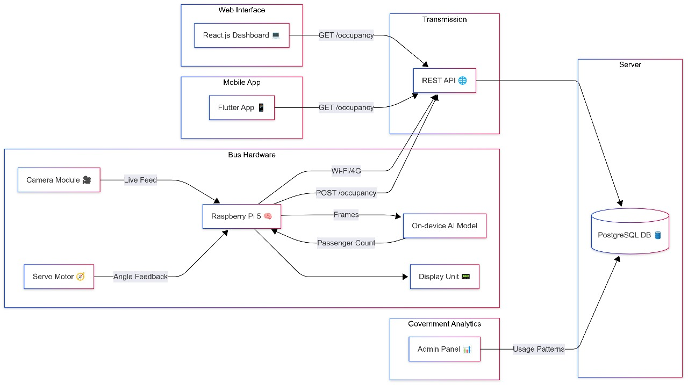
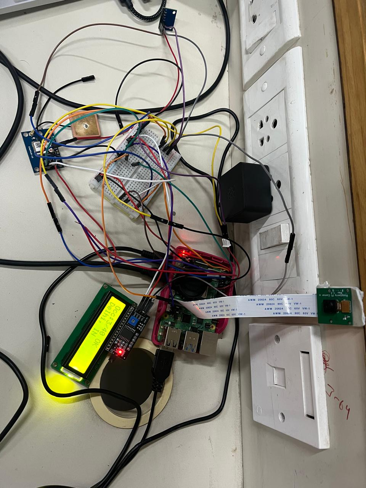

# SahYatri – Intelligent Public Transport Analytics Platform 🚍📡

SahYatri is an IoT-enabled transportation informatics system designed to optimize mass transit operations through real-time passenger density analytics. This comprehensive solution integrates embedded edge computing, computer vision, and full-stack web/mobile interfaces to provide actionable insights for transit authorities and commuters.

---

## 🌐 Architectural Overview

SahYatri comprises multiple modular components, each in its dedicated repository, working synergistically to monitor and analyze passenger distribution in public transit vehicles:

| Component | Description |
|-----------|-------------|
| [SahYatri-3DModel](https://github.com/yasharth-0910/SahYatri/tree/main/SahYatri-3DModel) | Ergonomic enclosure design for edge computing unit |
| [SahYatri-Hardware](https://github.com/yasharth-0910/SahYatri/tree/main/SahYatri-Hardware) | Embedded system implementation for data acquisition |
| [SahYatri-DetectionAI](https://github.com/yasharth-0910/SahYatri/tree/main/SahYatri-DetectionAI) | Computer vision pipeline for passenger flow analysis |
| [SahYatri-BusApi](https://github.com/yasharth-0910/SahYatri/tree/main/SahYatri-BusApi) | Distributed systems backend for data aggregation |
| [SahYatri-Website](https://github.com/yasharth-0910/SahYatri/tree/main/SahYatri-Website) | Operational intelligence dashboard |
| [SahYatri-MobileApp](https://github.com/yasharth-0910/SahYatri/tree/main/SahYatri-MobileApp) | Passenger-facing mobility application |

---

## 🏗 System Architecture

1. Edge Node captures visual data streams  
2. Vision Processing Unit analyzes spatial distribution  
3. Analytics Engine computes:
   - Current capacity utilization
   - Historical load patterns
   - Predictive crowding forecasts  
4. Data is:
   - Visualized locally via HMI interface
   - Transmitted to cloud-based data warehouse
   - Disseminated through web and mobile interfaces

---

## 🔧 List of Components Used

- Raspberry Pi 4  
- Raspberry Pi Camera 3 Wide  
- MPU6050 (Gyroscope + Accelerometer)  
- GPS Module  
- 16x2 LCD Display  
- I2C Module  
- Cooling Fan  

---

## 🛠 Technical Implementation

### Edge Computing Unit
- Raspberry Pi 4 with custom 3D-printed enclosure
- High-efficiency camera module
- I²C LCD interface for local monitoring
- Automated image processing pipeline

### Computer Vision System
- Optimized YOLOv5n convolutional neural network
- Real-time object detection at 15 FPS
- Dynamic density calculation algorithms
- Adaptive thresholding for varying lighting conditions

### Data Infrastructure
- Node.js/Express RESTful API
- PostgreSQL time-series database

### Visualization Interfaces
- React-based operational dashboard
- Responsive mobile application
- Administrative analytics portal
- Public information displays

---

## 🌍 Societal Impact

This system contributes to several United Nations Sustainable Development Goals:

🎯 SDG 9 - Industry, Innovation and Infrastructure  
🔹 Implementing smart infrastructure solutions  
🔹 Promoting technological innovation in public transit  

🎯 SDG 11 - Sustainable Cities and Communities  
🔹 Enhancing urban mobility efficiency  
🔹 Reducing transit-related energy consumption  

🎯 SDG 17 - Partnerships for the Goals  
🔹 Facilitating public-private collaborations  
🔹 Creating open-source mobility solutions  

---

## 🧩 System Design

## Project Images/Videos

## 👥 Team Members

- **Yasharth Singh** – [GitHub](https://github.com/yasharth-0910) – [LinkedIn](https://www.linkedin.com/in/yasharth-singh-b2493b284/)
- **Rakshit Suneja** – [GitHub](https://github.com/rakshit-21) – [LinkedIn](https://www.linkedin.com/in/rakshit-suneja-03894b329)
- **Shivam Kashyap** – [GitHub](https://github.com/Atom0204) – [LinkedIn](http://linkedin.com/in/shivam-kashyap-1899222b9)
- **Aman Verma** – [GitHub](https://github.com/AmanVerma1067) – [LinkedIn](https://in.linkedin.com/in/amanverma1067)
